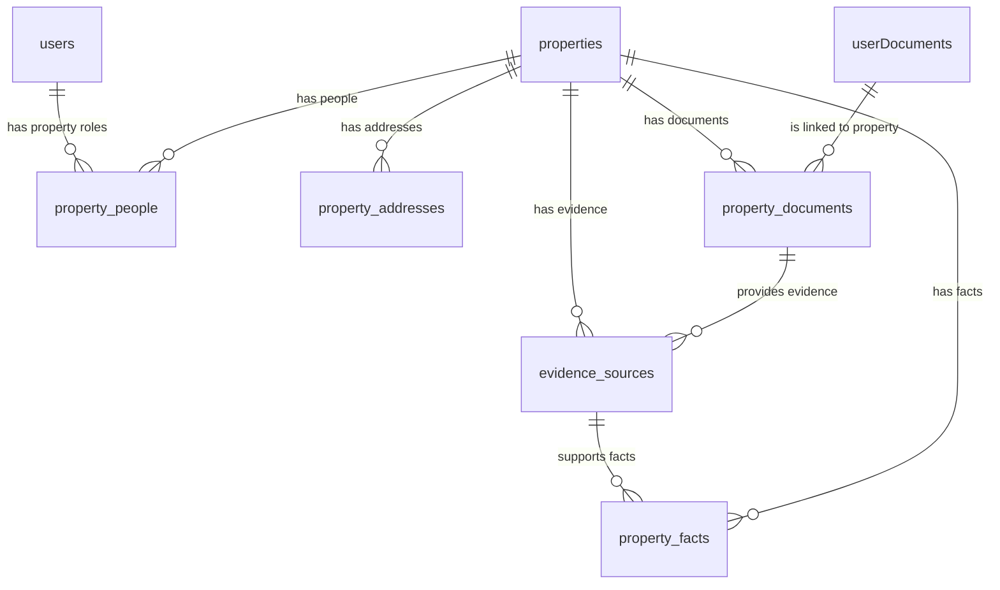

# Property + People Spine Schema

**Status:** Draft for review  
**Tracking ticket:** HT-308  
**Domain model:** HT-307 / `hometruth DOCS/docs/product/hometruth-domain-model.md`  
**Last updated:** 2026-05-25

## Objective

Define the first HomeTruth database spine for the core business model:

```text
Property Register + People Experience = HomeTruth
```

This document is a database contract only. It does not create migrations, API routes, frontend screens, or data backfills.

The schema must support:

- a canonical property record
- structured property addresses, including future UPRN support
- people connected to a property through meaningful relationships
- uploaded documents linked to properties
- property facts with evidence, confidence, provenance, and validity windows
- a future knowledge graph projection without introducing a graph database now

## Scope

### In Scope For First Schema Slice

- `properties`
- `property_addresses`
- `property_people`
- `property_documents`
- `evidence_sources`
- `property_facts`

### Out Of Scope For This Ticket

- Sequelize migration implementation
- model imports and runtime associations
- controller / route implementation
- frontend property profile screens
- document table consolidation
- blockchain anchoring
- contractor marketplace
- enterprise report pulls
- psychographic matching
- graph database setup

## Schema Decisions

1. MySQL remains the source of truth.
2. New domain tables should use `snake_case` database columns and `created_at` / `updated_at` timestamps.
3. Sequelize models for these tables should use `underscored: true` or explicit timestamp mappings.
4. The first implementation references existing `users.id` from `property_people`; it does not introduce a separate `people` table yet.
5. The first implementation links properties to the existing `userDocuments` upload table through `property_documents`; it does not replace the document vault yet.
6. `documents` remains the current system/admin knowledge-base table until a later document-consolidation ticket.
7. Facts are append-friendly and time-aware. Do not overwrite property truth in place when a newer fact should preserve history.
8. AI-created facts start as `suggested`; they become stronger only when confirmed or verified.
9. Relationship tables and fact/evidence tables must be shaped so they can later be projected into a graph.

## Naming Convention

Use a consistent convention by layer. Do not copy the current backend's mixed historical naming into the new property spine.

| Layer | Convention | Example |
| --- | --- | --- |
| Domain language | PascalCase, singular | `PropertyPerson`, `PropertyFact`, `EvidenceSource` |
| MySQL table names | snake_case, plural | `property_people`, `property_facts`, `evidence_sources` |
| MySQL column names | snake_case | `property_id`, `relationship_type`, `verification_status` |
| Sequelize model names | PascalCase, singular | `PropertyPerson` |
| Sequelize file names | camelCase or existing repo style | `propertyPerson.js`, `propertyFact.js` |
| API JSON fields | camelCase | `propertyId`, `relationshipType`, `verificationStatus` |

Terminology:

- `PropertyPerson` means the domain or Sequelize model concept.
- `property_people` means the physical MySQL table.
- The first implementation of `PropertyPerson` references `users.id`, because the current backend has no separate `people` table yet.

HT-309 should implement this by using Sequelize model names such as `PropertyPerson` with explicit `tableName: "property_people"` and `underscored: true`.

## Domain Evolution Rules

This is not the final HomeTruth schema. It is the first stable spine. Future domain work should expand it without repeatedly breaking existing code, data, or team understanding.

Rules:

1. Keep the core spine stable: `Property`, `PropertyPerson`, `PropertyDocument`, `EvidenceSource`, and `PropertyFact` are durable concepts.
2. Prefer additive migrations: add new tables, nullable columns, indexes, or relationships before renaming, deleting, or making fields mandatory.
3. Use facts and evidence for uncertain concepts: new property intelligence should usually start in `property_facts` and `evidence_sources` before becoming a dedicated table.
4. Promote to a table only when justified: create a dedicated table when a concept has its own lifecycle, workflow, permissions, high query volume, or multiple child relationships.
5. Preserve compatibility windows: old fields such as `users.home_address` stay readable until API and frontend consumers have moved to the new spine.
6. Separate schema migration from data backfill: structural migrations should be small and reversible where possible; backfills should be explicit follow-up work.
7. No destructive changes without a deprecation path: drops, renames, non-null constraints, and enum removals need a ticketed migration plan and rollback notes.
8. Every domain expansion needs a ticket and implementation log: update the schema contract, record the migration/API impact, and link the change to the ticket source of truth.

This means HT-309 can safely implement the first spine, while later tickets can add maintenance, compliance, reports, sharing, marketplace, enterprise, and graph projection layers without replacing the foundation.

## Relationship Model



## Tables

### `properties`

Canonical property record. A property can exist before any user claims it.

| Column | Type | Null | Notes |
| --- | --- | --- | --- |
| `id` | integer auto-increment | no | Primary key |
| `uprn` | varchar(32) | yes | Unique when known; nullable for early/manual/listing records |
| `property_type` | enum | no | `house`, `flat`, `maisonette`, `bungalow`, `commercial`, `land`, `mixed_use`, `unknown`; default `unknown` |
| `tenure` | enum | no | `freehold`, `leasehold`, `share_of_freehold`, `commonhold`, `unknown`; default `unknown` |
| `lifecycle_status` | enum | no | `unverified`, `active`, `archived`, `merged`, `deleted`; default `unverified` |
| `source_type` | enum | no | `manual`, `user_profile`, `listing`, `partner_api`, `import`, `system`; default `manual` |
| `source_ref` | varchar(255) | yes | External listing id, import id, partner id, or source reference |
| `created_by_user_id` | integer | yes | FK to `users.id`, `SET NULL` on delete |
| `created_at` | datetime | no | Default current timestamp |
| `updated_at` | datetime | no | Default current timestamp |

Indexes:

- primary key on `id`
- unique index on `uprn`
- index on `lifecycle_status`
- index on `source_type`, `source_ref`
- index on `created_by_user_id`

Implementation notes:

- `uprn` should not be mandatory in the first slice because existing records may only have free-text addresses or listing payloads.
- Do not store the canonical address directly on this table. Use `property_addresses`.

### `property_addresses`

Canonical and historical address records for a property.

| Column | Type | Null | Notes |
| --- | --- | --- | --- |
| `id` | integer auto-increment | no | Primary key |
| `property_id` | integer | no | FK to `properties.id`, `CASCADE` on delete |
| `is_current` | boolean | no | Default `true` |
| `address_line_1` | varchar(255) | no | First address line |
| `address_line_2` | varchar(255) | yes | Second address line |
| `town_city` | varchar(120) | yes | Town or city |
| `county` | varchar(120) | yes | County |
| `postcode` | varchar(16) | yes | Store normalized uppercase postcode |
| `country` | varchar(2) | no | ISO country code, default `GB` |
| `latitude` | decimal(10,7) | yes | Optional location |
| `longitude` | decimal(10,7) | yes | Optional location |
| `address_fingerprint` | char(64) | yes | Normalized hash for dedupe and import matching |
| `source_type` | enum | no | `manual`, `user_profile`, `listing`, `partner_api`, `import`, `system`; default `manual` |
| `confidence` | decimal(5,4) | yes | 0 to 1 confidence score |
| `valid_from` | date | yes | Address validity start |
| `valid_to` | date | yes | Address validity end |
| `created_at` | datetime | no | Default current timestamp |
| `updated_at` | datetime | no | Default current timestamp |

Indexes:

- primary key on `id`
- index on `property_id`
- index on `postcode`
- index on `address_fingerprint`
- index on `property_id`, `is_current`

Implementation notes:

- Enforce "one current address per property" in application logic initially. MySQL partial unique indexes should not be assumed until the exact production MySQL version is confirmed.
- `address_fingerprint` should be derived from normalized address fields, not from the raw user input string.

### `property_people`

The relationship between an authenticated user and a property. This is the core people side of the property + people model.

| Column | Type | Null | Notes |
| --- | --- | --- | --- |
| `id` | integer auto-increment | no | Primary key |
| `property_id` | integer | no | FK to `properties.id`, `CASCADE` on delete |
| `user_id` | integer | no | FK to `users.id`, `CASCADE` on delete |
| `relationship_type` | enum | no | `owner`, `buyer`, `seller`, `landlord`, `tenant`, `investor`, `agent`, `manager`, `contractor`, `lender`, `insurer`, `viewer`, `other` |
| `relationship_status` | enum | no | `invited`, `active`, `ended`, `revoked`, `disputed`; default `active` |
| `permission_level` | enum | no | `read`, `contribute`, `manage`, `admin`; default `read` |
| `is_primary` | boolean | no | Default `false` |
| `start_date` | date | yes | Relationship start |
| `end_date` | date | yes | Relationship end |
| `verification_status` | enum | no | `unverified`, `user_confirmed`, `evidence_verified`, `partner_verified`, `disputed`; default `unverified` |
| `source_type` | enum | no | `manual`, `user_profile`, `document`, `partner_api`, `system`; default `manual` |
| `source_ref` | varchar(255) | yes | Optional source reference |
| `created_at` | datetime | no | Default current timestamp |
| `updated_at` | datetime | no | Default current timestamp |

Indexes:

- primary key on `id`
- index on `property_id`
- index on `user_id`
- index on `property_id`, `relationship_type`
- index on `user_id`, `relationship_status`

Implementation notes:

- Prefer this table name over `user_properties`. The product model is people related to homes, not just users owning rows.
- The first implementation uses `users.id` because the current backend has no separate `people` table.
- If non-account people become first-class later, add `people` and link `users.person_id` rather than renaming the relationship concept.
- Do not derive access from `users.role`. Property-specific access belongs here.

### `property_documents`

The link between a property and an uploaded user document.

| Column | Type | Null | Notes |
| --- | --- | --- | --- |
| `id` | integer auto-increment | no | Primary key |
| `property_id` | integer | no | FK to `properties.id`, `CASCADE` on delete |
| `user_document_id` | integer | no | FK to `userDocuments.id`, `CASCADE` on delete |
| `linked_by_user_id` | integer | yes | FK to `users.id`, `SET NULL` on delete |
| `document_role` | varchar(100) | yes | Optional role override, e.g. `title_deed`, `epc`, `invoice`, `survey`, `insurance` |
| `relevance` | enum | no | `primary`, `evidence`, `supporting`, `reference`, `other`; default `supporting` |
| `effective_date` | date | yes | When document starts applying |
| `expiry_date` | date | yes | When document expires |
| `is_active` | boolean | no | Default `true` |
| `created_at` | datetime | no | Default current timestamp |
| `updated_at` | datetime | no | Default current timestamp |

Indexes:

- primary key on `id`
- unique index on `property_id`, `user_document_id`
- index on `user_document_id`
- index on `linked_by_user_id`
- index on `property_id`, `relevance`
- index on `property_id`, `expiry_date`

Implementation notes:

- This table gives existing uploaded files a property context without replacing the upload service.
- A later document-consolidation ticket should decide whether `documents` and `userDocuments` merge into one canonical `documents` table.
- A document can support multiple facts through `evidence_sources`.

### `evidence_sources`

A specific source behind a property fact or future insight.

| Column | Type | Null | Notes |
| --- | --- | --- | --- |
| `id` | integer auto-increment | no | Primary key |
| `property_id` | integer | no | FK to `properties.id`, `CASCADE` on delete |
| `property_document_id` | integer | yes | FK to `property_documents.id`, `SET NULL` on delete |
| `user_document_id` | integer | yes | FK to `userDocuments.id`, `SET NULL` on delete; denormalized trace to current upload table |
| `source_type` | enum | no | `user_document`, `system_document`, `url`, `manual`, `partner_api`, `listing`, `ai_extraction` |
| `source_name` | varchar(255) | yes | Human-readable source name |
| `source_url` | text | yes | URL if applicable |
| `source_date` | date | yes | Date represented by the source |
| `extraction_method` | enum | no | `manual`, `ocr`, `ai`, `partner_api`, `system`; default `manual` |
| `extracted_by_user_id` | integer | yes | FK to `users.id`, `SET NULL` on delete |
| `excerpt` | text | yes | Short supporting excerpt, not full document text |
| `page_number` | integer | yes | Page number where evidence was found |
| `locator` | json | yes | Bounding box, section path, API path, or other source locator |
| `confidence` | decimal(5,4) | yes | 0 to 1 confidence score |
| `created_at` | datetime | no | Default current timestamp |
| `updated_at` | datetime | no | Default current timestamp |

Indexes:

- primary key on `id`
- index on `property_id`
- index on `property_document_id`
- index on `user_document_id`
- index on `source_type`
- index on `extraction_method`
- index on `confidence`

Implementation notes:

- Preserve evidence even when facts change. Evidence is provenance, not just a temporary extraction result.
- At least one of `property_document_id`, `user_document_id`, `source_url`, or `source_name` should be present. Enforce this in application validation unless production MySQL check-constraint support is confirmed.
- `excerpt` should be short and source-specific. Full document text remains in the document storage / vector pipeline.

### `property_facts`

Structured, evidence-backed claims about a property.

| Column | Type | Null | Notes |
| --- | --- | --- | --- |
| `id` | integer auto-increment | no | Primary key |
| `property_id` | integer | no | FK to `properties.id`, `CASCADE` on delete |
| `evidence_source_id` | integer | yes | FK to `evidence_sources.id`, `SET NULL` on delete |
| `fact_namespace` | varchar(80) | no | `identity`, `legal`, `energy`, `risk`, `maintenance`, `valuation`, `insurance`, `listing`, etc. |
| `fact_type` | varchar(120) | no | Specific fact key, e.g. `epc_rating`, `boiler_service_date`, `flood_risk` |
| `value_json` | json | no | Typed value payload |
| `display_value` | varchar(500) | yes | User-facing summary value |
| `unit` | varchar(50) | yes | Unit where applicable |
| `valid_from` | date | yes | Fact validity start |
| `valid_to` | date | yes | Fact validity end |
| `observed_at` | datetime | yes | When the fact was observed or extracted |
| `is_current` | boolean | no | Default `true` |
| `confidence` | decimal(5,4) | yes | 0 to 1 confidence score |
| `verification_status` | enum | no | `suggested`, `user_confirmed`, `evidence_verified`, `partner_verified`, `disputed`, `expired`; default `suggested` |
| `created_from` | enum | no | `manual`, `ocr`, `ai`, `partner_api`, `system`; default `manual` |
| `created_by_user_id` | integer | yes | FK to `users.id`, `SET NULL` on delete |
| `created_at` | datetime | no | Default current timestamp |
| `updated_at` | datetime | no | Default current timestamp |

Indexes:

- primary key on `id`
- index on `property_id`
- index on `evidence_source_id`
- index on `property_id`, `fact_namespace`, `fact_type`
- index on `property_id`, `is_current`
- index on `verification_status`
- index on `valid_from`, `valid_to`

Implementation notes:

- Treat AI extractions as `suggested` until user-confirmed or evidence-verified.
- Do not delete old facts just because a new one arrives. Mark previous facts as not current or expired where needed.
- A future many-to-many join table, `property_fact_evidence_sources`, may be needed when one fact has multiple sources. The first slice can use a single `evidence_source_id` to stay simple.
- Do not store personal psychographic data here. This table is property truth.

## Graph-Ready Projection

The relational schema should be projectable into graph edges later:

```text
User --[HAS_RELATIONSHIP {relationship_type, permission_level}]--> Property
Property --[HAS_ADDRESS {is_current, confidence}]--> PropertyAddress
Property --[HAS_DOCUMENT {relevance, effective_date, expiry_date}]--> UserDocument
PropertyDocument --[PROVIDES_EVIDENCE]--> EvidenceSource
EvidenceSource --[SUPPORTS {confidence}]--> PropertyFact
Property --[HAS_FACT {fact_type, valid_from, valid_to}]--> PropertyFact
```

Graph readiness requirements:

- Relationship tables must name the relationship type.
- Evidence records must preserve source, method, date, confidence, and locator.
- Facts must preserve namespace, type, value, confidence, verification status, and validity window.
- Facts must not collapse time history into a single mutable field.
- AI outputs must be identifiable by `created_from` and `verification_status`.

## Migration Order For HT-309

1. Create `properties`.
2. Create `property_addresses`.
3. Create `property_people`.
4. Create `property_documents`.
5. Create `evidence_sources`.
6. Create `property_facts`.
7. Add Sequelize models and associations.
8. Run `npm run db:migrate:status`.
9. Run `npm run db:migrate` against local `hometruth-mysql`.
10. Run `npm run db:migrate:status` again and record output in the ticket.

## Non-Destructive Data Mapping

### `users.home_address`

Do not delete or rewrite this field in the first migration.

Later backfill path:

1. For each user with `home_address`, create or match a `properties` row.
2. Create a `property_addresses` row with `source_type = user_profile`.
3. Create a `property_people` row with `relationship_type = owner` or `viewer` only where the user flow makes that relationship explicit.
4. Leave `users.home_address` in place until API and frontend reads have moved to the property spine.

### `userDocuments`

Keep this as the current upload/vault table in the first slice.

Later linking path:

1. When a user uploads a document in a property context, create `property_documents`.
2. When AI extracts structured information, create `evidence_sources`.
3. When a verified or suggested property claim is produced, create `property_facts`.

### `documents`

Treat as the current system/admin knowledge-base table. Do not merge it with `userDocuments` in HT-309.

Later consolidation ticket:

- define one canonical document table or keep separate bounded contexts
- migrate fields deliberately
- update vector metadata and search controllers

### `bookmarked_listings`

Do not migrate listing blobs automatically in HT-309.

Later mapping path:

1. Create or match `properties` from bookmarked listing address/identifier when the user saves or claims it.
2. Store listing-derived fields as `property_facts` with `fact_namespace = listing`.
3. Preserve external listing ids in `properties.source_ref` or fact/evidence source metadata.

## Validation Rules

- A property may have many people; a user may relate to many properties.
- Property access must be resolved through `property_people`, not through global `users.role`.
- A property fact must belong to one property.
- A property fact without evidence is allowed only when created manually or by system import, and must keep `verification_status = suggested` or `user_confirmed`.
- Evidence generated by AI must retain the extraction method and confidence.
- Current facts and addresses are convenience flags; history must remain queryable.

## Follow-Up Tickets

- HT-309: Implement property + people spine migrations and Sequelize models.
- HT-310: Add property profile API endpoints.
- HT-311: Link document upload flow to properties.
- HT-312: Backfill `users.home_address` into property spine.
- HT-313: Consolidate `documents` and `userDocuments` bounded contexts.
